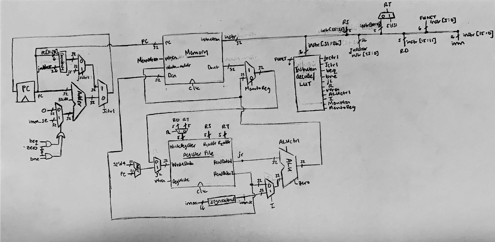

# CompArch Lab 4: Pipelined CPU

Jonah Spicher and Melissa Guzman <br>
November 2019<br>

## Block Diagram and Description of Changes
<br>


The main change to the design was the addition of the register bank. This broke the CPU into five stages: instruction fetch, register fetch, execute, memory, and write back (in order). An instruction is parsed in the IF stage, accesses the register files in the RF stage, runs through the ALU in execute, accesses memory in MEM, and finally writes back to the register file in WB. After the first instruction passes through to WB, each stage always contains data pertaining to an instruction until the end of the program. 

In order to facilitate this pipeline, a series of registers separate each stage. Data from each read port enters a register where it waits for one clock cycle before being sent to the ALU. There, the ALU operation occurs and the output waits another clock cycle before continuing to memory, and so on. All controls were filtered through a large bank of registers in order to deliver them to their targets when the correct data was in place, where they are denoted as [control name]\_ready. 

Numerous edge cases and hazards result from using this architecture. We attempted to address them, as explained below:

 - Forwarding: When a program attempts to use data before it has been written to the register file, errors can occur. For example if line 1 is `addi $t0 $zero 5` and line 2 is `add $t1 $t0 $zero`, when line two has reached the RF stage, line one will only just be started EX. This was referred to in the code as a "one above" error, and similar hazards arise from "two above" and "three above" errors. To solve this, each case was accounted for specifically by connecting the output of various registers to a multiplexer feeding into the ALU in the EX stage. For one above forwarding, data in the MEM stage is piped back to the EX stage, for two above forwarding, data from the WB stage is sent back to EX, and for three above forwarding, a special extra register set up specifically for this case sends data back to EX. In all cases, the hazard was detected when the registers attempting to be read were in the RF stage, and then the mux controls to handle the hazard were activated after one clock cycle (to catch them in the execute phase).  
 - Loading stalls: Even with forwarding, some hazards happen quickly enough that a stall is necessary. For example, if a program loads data into register t0 on line 1 and then tries to use register t0 in the next line, a hazard similar to the above but more severe occurs. This time, instead of becoming available at the end of the EX phase, the data is not available until the MEM phase. Because the stall is detected in line 2's RF stage, while line 1 is still in EX, this requires line 2 (and all lines after it) to stall. This was accomplished simply by setting the enable to zero on each register which transitioned from IF to RF and from RF to EX. While line 2 sits idle, line 1 reaches the memory stage, and the correct t0 data becomes available. Then, at the next clock cycle, this data is fed through a multiplexer into the ALU in place of whatever nonsense came out of the register file. For two above load forwarding, no stall is necessary, and the data is collected from the same place (it just happens to already be available). For three above load forwarding, the data is captured from the extra register added for three above forwarding described above.
 - Branches and Jumps: Normal jump instructions are taken care of fairly easily, as each instruction is fully parsed in the IF stage, and `jal` is straightforward in that while information does propagate forward to the register file, the actual jump does not require register information. Branches and `jr` present a particular problem because they require information stored in the register in order to go to the correct address in program memory. This problem is solved by combining two partial solutions: first, delayed branching is used, so that branching information is allowed to reach the program counter controls as late as the RF stage. Notice that this solves any `jr` related problems, as all `jr` requires is the value stored in register 31 ($ra). Branching, however, in theory requires the output of the ALU, which is not provided until the EX stage, so further measures are necessary. In order to do this, a subtraction module (not a full ALU) is added. In the old cingle cycle CPU, branching was controlled by a multiplexer whose output fed into the adder which was responsible for cycling the program counter. The inputs of this multiplexer were an immediate loaded in from the instruction or 0. The address pin of this mux was itself the output of a mux, for which the address pin was the ALU zero flag, and input 1 was high when BEQ was true, and input two was high when BNE was true. All this did was ensure that the immediate was selected if BNE or BEQ was true and zero was the relevant value. Now, instead of the select coming from the ALU, it comes from the output of the added subtraction module. This is fed from the two read ports of the register file, and so is correct in the RF stage. All controls pertaining to branching are delayed 1 clock cycle so that they arrive in the RF stage.
 - Branch Forwarding: The implementation described above ignores a few important edge cases. Sometimes, a branch will attempt to compare two registers which were recently instructed to be written to, and so the data will not be ready. This is more difficult to address than a normal forwarding hazard, because it can occur simultaneously with other hazards. As a result, this is where our implementation stops being 100% functional. In one above branch forwarding, a stall is necessary (because the EX stage has to finish its computation before the output can be used). This causes problems when combined with other branch forwarding. For example, in the program below (which is borrowed from one of our test cases):
 ```
  addi $t0, $zero, 6    # Set $t0 to 6
  addi $t1, $zero, 4    # Set $t1 to 4
  add $t2, $zero, $t0   # Set $t2 to $t0
  add $t3, $zero, $t1   # Set $t3 to $t1
  beq $t2, $t3, exit    # If t2 == t3, go to exit condition 
 ```
  There is an issue where $t3 requires a stall but $t2 does not. This leaves the data which is supposed to be in    $t2 in an unexpected place when forwarding attempts to retrieve it, an issue which is further compounded by the add $t3 line requiring forwarding to retireve $t1 data. This specific situation caused an error in which $t3 was held as the write register for three clock cycles and repeatedly overwritten, which causes the program to get an incorrect result. 

## Test Plan & Results

First, a batch of tests was done with several short series of instructions meant to test secific cases such as basic functionality, jumping, branching, forwarding, etc. Here, we fixed a lot of issues with our enormous register bank module and ensured every command was where it needed to be when it was needed. Once these were working as expected, we moved on to larger programs.

As before, we tested our CPU using three (modified) programs: Multiply.asm, LCM.asm, and exp.asm. Our test bench was identical, only the cpu and the assembly loaded to it changed. 

We first tested the cpu with Multiply.asm. No ops were added after branching due to the delayed branching "feature" (and no real opportunity to use delayed branching in such a straightforward program). This program was instrumental in revealing a huge assortment of issues with forwarding and branching. It runs successfully on our CPU.

The second test (LCM)  was slightly more complicated, involving the SLT instruction as well as more looping and a greater number of instructions. While for the single cycle CPU it provided no real additional challenge, it presented a huge hurdle for our pipelined CPU, because it contained edge cases for branch forwarding we had not considered. This proved to be too great a challenge to solve by the time it was discovered, but we are confident that these issues are one of very few (if not the only ones) remaining in our implementation. If two No Op lines are added before the second add line in the example pasted above, the code works as expected, and produces the correct result.

Because LCM was unsuccessful, we did not get around to successfully testing exp.asm on our pipelined cpu. Technically the test bench runs the code, but we have not inspected the results, only seen that the program counter is set too high for memory, and an error is thrown. Also, exp.asm has not yet been fully edited to account for delayed branching, so it is not expected to work as is. 

### Results
Currently, the pipelined CPU does not work in all cases. Some simple programs may run, or programs padded excessively with no ops, but it cannot properly be called functional. 

### Running the Tests
A Makefile allows a few commands to run a suite of tests from the verilog subfolder. We recommend "make runAuto," as this command runs all of the test benches exluding the look up table (the LUT does not report its own success and clutters the terminal). If you want to see all, including the LUT, "make runAll" will run all test benches. "make run" will run only the cpu test. 

## Design Reuse:
As explained in the previous lab, multiple components of this design were reused. They are listed below and credited:
- The ALU created by Jonah’s lab 1 team was used, though a new test bench was written and a minor bug was fixed. 
- The decoder was provided in Homework 4. 
- The multiplexer.v file contains four multiplexers, three of which are reused from old labs (as they are used by components which have been reused, such as the ALU).
- The register file (as well as register.v) was taken from one of our homework 4’s, as well as the test bench (though minor edits to the test bench were made.
- Obviously, the CPU itself was largely reused from our lab 3
